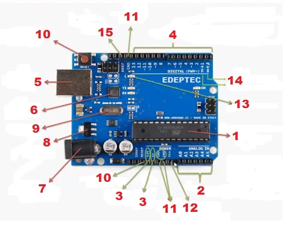

# Arduino
Arduino es una plataforma de hardware y software de código abierto que se utiliza para construir proyectos electrónicos. Se basa en un microcontrolador, que es un pequeño ordenador que se puede programar para realizar tareas específicas.
## Su funcionamiento
1. **Entrada (Captura):** Recibe datos del entorno mediante sus pines.
* **Digitales:** Detectan solo encendido/apagado (`1` o `0`).
* **Analógicos:** Miden variaciones continuas de voltaje (ej. temperatura o luz).

2. **Procesamiento (Decisión):** El microcontrolador ejecuta el código subido (*Sketch*). Lee los datos, aplica la lógica programada (`setup` una vez, `loop` infinitamente) y decide qué hacer.

3. **Salida (Acción):** Envía señales a través de sus pines para controlar componentes externos (encender LEDs, activar motores, mostrar texto en pantallas o enviar señales PWM).

## Sus partes

* **Microcontrolador:** Es el circuito integrado principal ("cerebro" de la placa) que almacena el programa (*sketch*) y procesa todas las instrucciones para controlar los demás componentes.

* **Pines Digitales (0 al 13):** Permiten leer y enviar señales binarias, es decir, únicamente dos estados: encendido (`1` / 5V) o apagado (`0` / 0V).

* **Pines PWM (marcados con `~`):** Pines digitales especiales (3, 5, 6, 9, 10 y 11) que mediante *Modulación por Ancho de Pulso* simulan variaciones de voltaje para regular la intensidad de luces o la velocidad de motores.

* **Pines Analógicos (A0 al A5):** Entradas diseñadas para medir niveles variables de voltaje de 0V a 5V, traduciendo valores del mundo real (como temperatura, luz o presión) a un rango numérico de 0 a 1023.

* **Puerto USB:** Conector tipo B que permite vincular la placa a la computadora para cargar programas, transmitir datos en tiempo real y suministrar la energía necesaria para su funcionamiento básico.

* **Control de USB (Chip de interfaz):** Circuito integrado intermedio que traduce el protocolo USB de la computadora a la comunicación serial que entiende el microcontrolador.

* **Jack de Alimentación (DC):** Conector cilíndrico para alimentar la tarjeta mediante una fuente externa (como una batería o un transformador de pared) con un rango recomendado de 7V a 12V.

* **Regulador de Voltaje:** Componente encargado de estabilizar la energía proveniente del Jack o del pin Vin para entregar una tensión fija y constante de 5V a los circuitos de la placa.

* **Pines de Alimentación (5V, 3.3V, Vin):** Salidas de energía para alimentar componentes externos que requieren poca corriente, o entrada de alimentación externa directa (Vin).

* **Pines GND (Tierra):** Puntos de conexión a 0V requeridos para cerrar el circuito eléctrico de los componentes que conectes.

* **Cristal de Cuarzo (Oscilador):** Fija la velocidad de trabajo del microcontrolador haciendo oscilar una frecuencia fija de 16 MHz (marca el "ritmo" o ciclo de reloj).

* **Botón de Reinicio (Reset):** Interruptor que corta momentáneamente la línea de energía del pin principal para detener el código actual y hacer que vuelva a ejecutarse desde la primera línea.

* **LED Integrado:** Indicador luminoso de pruebas conectado internamente al **Pin 13**, útil para verificar la placa sin necesidad de cablear componentes adicionales.

* **Pines RX y TX (0 y 1):** Pines dedicados a la comunicación serie. **RX** recibe datos y **TX** los transmite (asociados también a los LEDs indicadores de la placa).

* **Pin AREF (Referencia Analógica):** Permite fijar un límite de tensión superior personalizado (menor a 5V) como referencia máxima para las lecturas de los pines analógicos.

# Cuadro comparativo
## Cuadro Comparativo: Señales Digitales, Analógicas y PWM

| Característica | Señal Digital | Señal Analógica | PWM (Modulación por Ancho de Pulso) |
| :--- | :--- | :--- | :--- |
| **Valores posibles** | Solo 2 estados discretos: HIGH (1 / 5V) o LOW (0 / 0V)[cite: 1] | Rango continuo con infinitos valores intermedios[cite: 1] | 2 niveles de voltaje (0V/5V), modulando el tiempo en HIGH (Duty Cycle)[cite: 1] |
| **Dirección habitual** | Entrada o Salida[cite: 1] | Entrada (lectura de sensores)[cite: 1] | Salida (control simulado de intensidad/velocidad)[cite: 1] |
| **Funciones en Arduino** | `digitalRead()` / `digitalWrite()`[cite: 1] | `analogRead()`[cite: 1] | `analogWrite()`[cite: 1] |
| **Rango de valores en código** | `0` o `1` (`LOW` / `HIGH`)[cite: 1] | `0` a `1023` (Resolución ADC de 10 bits)[cite: 1] | `0` a `255` (Resolución de 8 bits)[cite: 1] |
| **Pines en Arduino UNO** | Cualquier pin digital (ej. 0 al 13)[cite: 1] | Pines de entrada analógica `A0` a `A5`[cite: 1] | Pines digitales con el símbolo `~` (ej. 3, 5, 6, 9, 10, 11)[cite: 1] |
| **Principio de funcionamiento** | Transición abrupta entre dos niveles de voltaje sin estados intermedios[cite: 1] | Refleja variaciones graduales y continuas de un fenómeno físico[cite: 1] | Conmutación digital rápida que genera un efecto promedio según el porcentaje de ancho de pulso[cite: 1] |
| **Ejemplos de aplicación** | Pulsador, sensor PIR, relé, LED (encendido/apagado)[cite: 1] | Potenciómetro, LDR (luz), LM35 (temperatura), sensor de humedad[cite: 1] | Control de brillo de LED, velocidad de motores DC, servomotores[cite: 1] |

